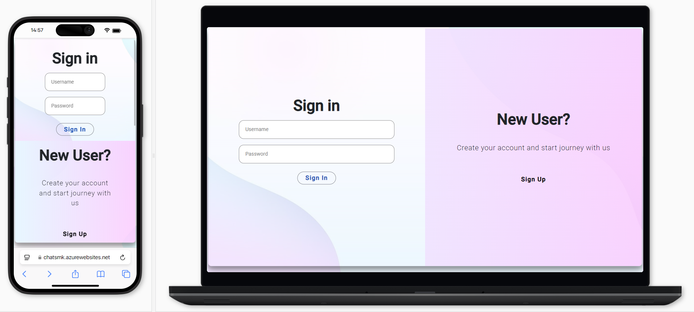
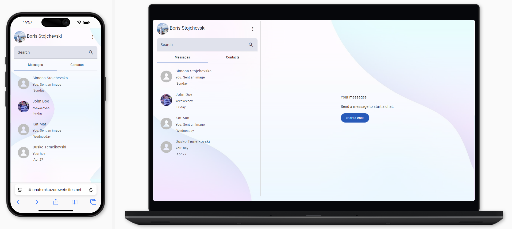
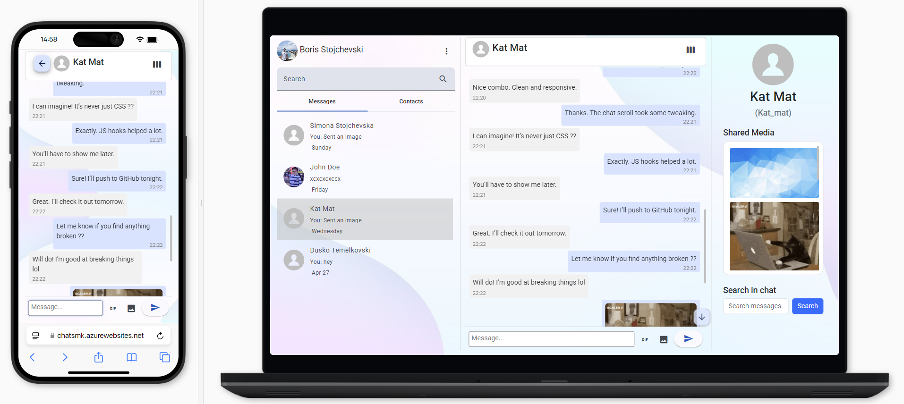
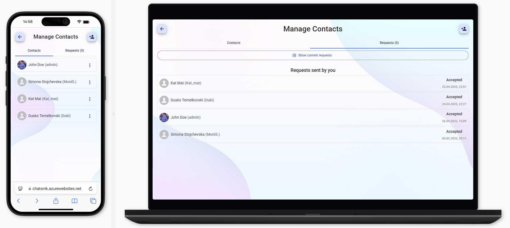
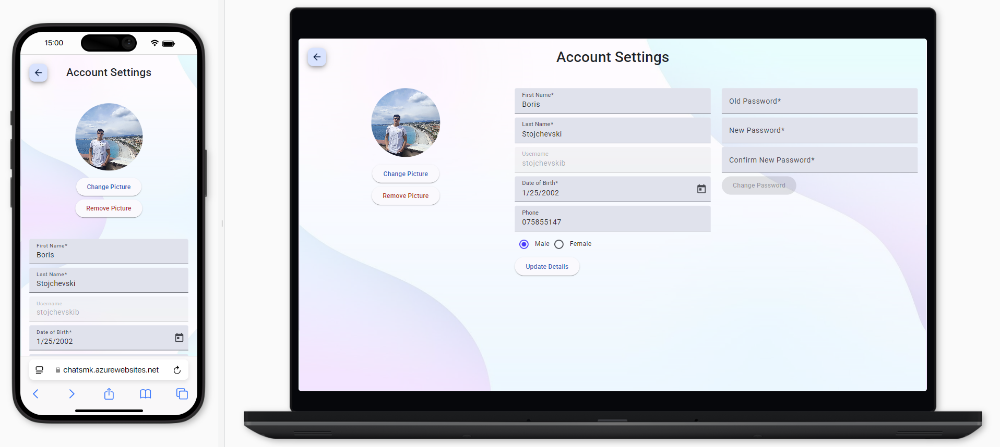

# ChatsApp - Real-time Chat Application
<p align="center"> <a href="https://github.com/stojchevskiboris/ChatsApp"><kbd>  </kbd> </a> <h3 align="center">ChatsApp - Real-time Chat Application</h3> <p align="center"> A real-time messaging application built with .NET Core, Angular, and SignalR. 
  <br/> <br/> 
  <a href="https://dotnet.microsoft.com/"><strong>Explore the docs »</strong></a> <br/> <br/> 
  <a href="https://chatsmk.azurewebsites.net/"><strong>Try ChatsApp »</strong></a> </p> </p>

## About The Project
ChatsApp is a real-time chat application that allows users to communicate seamlessly. With the combination of Angular for the frontend, .NET Core 8 for the backend, and SignalR for real-time communication, ChatsApp provides an engaging chat experience.

## Screenshots 
### Screen 1 - Login Page
<kbd>  </kbd>
### Screen 2 - Home Page
<kbd>  </kbd>
### Screen 3 - Chat
<kbd>  </kbd>
### Screen 4 - Contacts
<kbd>  </kbd>
### Screen 5 - Settings
<kbd>  </kbd>

## Built With
This project is built using the following technologies:

<a href='https://angular.io/'>Angular 18</a> (Frontend)

<a href='https://dotnet.microsoft.com/'>.NET Core 8</a> (Backend)

<a href='https://signalr.net/'>SignalR</a> (Real-Time Communication)

<a href='https://azure.microsoft.com/en-us/services/sql-database/'>Azure MSSQL</a> (Database)

<a href='https://firebase.google.com/docs/firestore'>Google Firestore</a> (File Storage)

<a href='https://getbootstrap.com/'>Bootstrap 5</a> (Styling)

<a href='https://material.angular.io/'>Angular Material</a> (UI Components)

## Getting Started


### Installation
Clone the repo

```sh
git clone https://github.com/stojchevskiboris/ChatsApp
```

## Project Setup

```sh
npm install
```

### Compile and Hot-Reload for Development

```sh
npm run dev
```

### Compile and Minify for Production

```sh
npm run build
```

### License
This project is licensed under the MIT License - see the LICENSE file for details.
